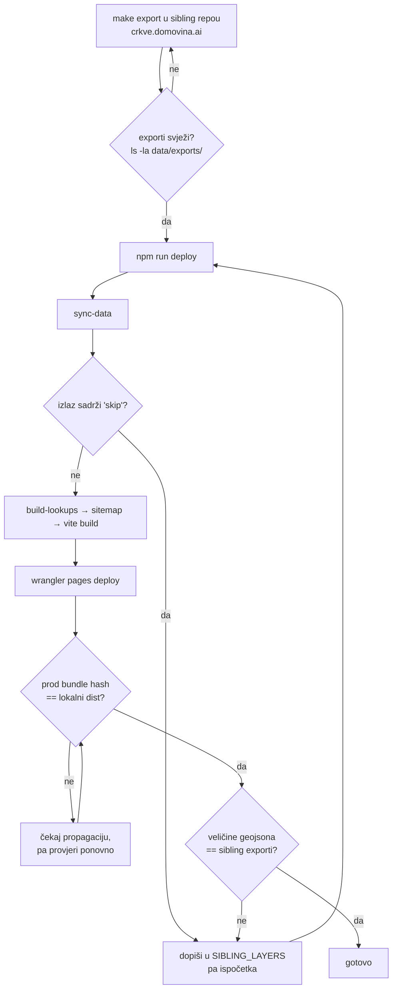

# Deploy lanac — tihi kvarovi i kako se verificira

**Datum:** 2026-08-17
**Povod:** pri deployu c66576c otkriveno da sloj Biskupije nikad nije bio u automatskom syncu, a produkcija ga je servirala.

---

## 1. `sync-data` preskače tiho

`scripts/sync-data.mjs` kopira tematske slojeve iz sestrinskih repoa u `public/data/`:

```js
const SIBLING_LAYERS = [
  ["../../../crkve.domovina.ai/data/exports",
   ["crkve.geojson", "zupe.geojson", "biskupije.geojson"]],
];
```

Ako datoteka ne postoji, skripta ispiše `skip` i **nastavi s izlaznim kodom 0**:

```js
if (!existsSync(src)) {
  console.warn(`  skip ${f} (nema ${relDir} — pokreni tamo \`make export\`)`);
  continue;
}
```

`deploy.sh` ima `set -euo pipefail`, ali to ovdje ne pomaže — nema nenultog exita. **Deploy prođe zeleno, a sloj ode u produkciju prazan ili zamrznut na staroj verziji.**

### Što je konkretno zateknuto

Sloj Biskupije pušten je commitom `95e805f`, ali `SIBLING_LAYERS` je nabrajao samo `crkve.geojson` i `zupe.geojson`. Sloj je na produkciji radio **isključivo zato što je `biskupije.geojson` nekad ručno dospio u `public/data/`** — a `public/data/` je gitignored, pa toga nema u povijesti.

Posljedica da nije uočeno: sljedeći `make export` u `crkve.domovina.ai` ne bi stigao na kartu. Bez poruke o grešci, bez pada testa. Karta bi mjesecima prikazivala zastarjele granice biskupija.

Popravljeno u `c66576c` — `sync-data` sad javlja `Synced 15 geojson` umjesto 14.

### Pravilo

> Svaki novi sloj iz sibling repoa mora se dopisati u `SIBLING_LAYERS`. Nije dovoljno da datoteka postoji u `public/data/` i da sloj radi lokalno.

Isti obrazac kao kod `CLUB_COLS` u `apps/data-pipeline/scripts/20_export_football_clubs.py`: promjena u sibling repou traži izmjenu na našoj strani, a propust je tih.

---

## 2. Kako se verificira deploy

Lokalni `npm run build` ne dokazuje ništa o produkciji — CF Pages zna servirati stari bundle iz edge cachea (vidi povijest s `sw.js` i chunk poisoningom).

### Bundle hash

```bash
curl -s https://gis.domovina.ai/ | grep -oE 'assets/index-[A-Za-z0-9_-]+\.js'
ls dist/assets/ | grep -E '^index-.*\.js$'
```

Hashevi se moraju poklapati. Ako se ne poklapaju, deploy nije propagirao — ne „vjerojatno treba još malo".

### Podatkovni slojevi

```bash
for f in biskupije zupe crkve; do
  printf "%-12s %s\n" "$f" \
    "$(curl -s -o /dev/null -w '%{http_code} %{size_download}B' \
       https://gis.domovina.ai/data/$f.geojson)"
done
```

Veličine se moraju poklapati s onima u `~/git/domovinatv/crkve.domovina.ai/data/exports/`. Status 200 sam po sebi ne znači ništa — SPA fallback zna vratiti 200 s `index.html` za nepostojeći path.

### Sučelje

Za promjene u UI-ju provjeri na živoj stranici, ne na `localhost` previewu. Korisno kao jedan `evaluate`:

```js
const panel = document.querySelector('[data-testid="layers-panel"]');
const sc = panel.querySelector('.overflow-y-auto');
({
  panelBottom: panel.getBoundingClientRect().bottom,   // < window.innerHeight
  scrolls: sc.scrollHeight > sc.clientHeight,          // panel doista skrola
  emojiLeft: /[\u{1F300}-\u{1FAFF}]/u.test(document.body.innerText),  // false
});
```

---

## 3. Redoslijed koji radi



Ključno je da se **korak E čita**, a ne samo završna linija `Synced N geojson`.

---

## Vezani dokumenti

- [`ui-refactor-plan.md`](./ui-refactor-plan.md) — plan UI refactora u pet faza, dijagnoza i status
- `README.md` (odjeljak „Odakle dolaze podaci layera") — tablica sloj → sibling repo
