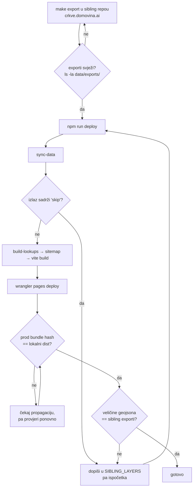

# Deploy lanac — tihi kvarovi i kako se verificira

**Datum:** 2026-08-17
**Povod:** pri deployu c66576c otkriveno da sloj Biskupije nikad nije bio u automatskom syncu, a produkcija ga je servirala.

---

## 1. `sync-data` preskače tiho

`scripts/sync-data.mjs` kopira tematske slojeve iz sestrinskih repoa u `public/data/`:

```js
const SIBLING_LAYERS = [
  ["../../../crkve.domovina.ai/data/exports",
   ["crkve.geojson", "zupe.geojson", "biskupije.geojson"]],
];
```

Ako datoteka ne postoji, skripta ispiše `skip` i **nastavi s izlaznim kodom 0**:

```js
if (!existsSync(src)) {
  console.warn(`  skip ${f} (nema ${relDir} — pokreni tamo \`make export\`)`);
  continue;
}
```

`deploy.sh` ima `set -euo pipefail`, ali to ovdje ne pomaže — nema nenultog exita. **Deploy prođe zeleno, a sloj ode u produkciju prazan ili zamrznut na staroj verziji.**

### Što je konkretno zateknuto

Sloj Biskupije pušten je commitom `95e805f`, ali `SIBLING_LAYERS` je nabrajao samo `crkve.geojson` i `zupe.geojson`. Sloj je na produkciji radio **isključivo zato što je `biskupije.geojson` nekad ručno dospio u `public/data/`** — a `public/data/` je gitignored, pa toga nema u povijesti.

Posljedica da nije uočeno: sljedeći `make export` u `crkve.domovina.ai` ne bi stigao na kartu. Bez poruke o grešci, bez pada testa. Karta bi mjesecima prikazivala zastarjele granice biskupija.

Popravljeno u `c66576c` — `sync-data` sad javlja `Synced 15 geojson` umjesto 14.

### Pravilo

> Svaki novi sloj iz sibling repoa mora se dopisati u `SIBLING_LAYERS`. Nije dovoljno da datoteka postoji u `public/data/` i da sloj radi lokalno.

Isti obrazac kao kod `CLUB_COLS` u `apps/data-pipeline/scripts/20_export_football_clubs.py`: promjena u sibling repou traži izmjenu na našoj strani, a propust je tih.

---

## 2. Kako se verificira deploy

Lokalni `npm run build` ne dokazuje ništa o produkciji — CF Pages zna servirati stari bundle iz edge cachea (vidi povijest s `sw.js` i chunk poisoningom).

### Bundle hash

```bash
curl -s https://gis.domovina.ai/ | grep -oE 'assets/index-[A-Za-z0-9_-]+\.js'
ls dist/assets/ | grep -E '^index-.*\.js$'
```

Hashevi se moraju poklapati. Ako se ne poklapaju, deploy nije propagirao — ne „vjerojatno treba još malo".

### Podatkovni slojevi

```bash
for f in biskupije zupe crkve; do
  printf "%-12s %s\n" "$f" \
    "$(curl -s -o /dev/null -w '%{http_code} %{size_download}B' \
       https://gis.domovina.ai/data/$f.geojson)"
done
```

Veličine se moraju poklapati s onima u `~/git/domovinatv/crkve.domovina.ai/data/exports/`. Status 200 sam po sebi ne znači ništa — SPA fallback zna vratiti 200 s `index.html` za nepostojeći path.

### Sučelje

Za promjene u UI-ju provjeri na živoj stranici, ne na `localhost` previewu. Korisno kao jedan `evaluate`:

```js
const panel = document.querySelector('[data-testid="layers-panel"]');
const sc = panel.querySelector('.overflow-y-auto');
({
  panelBottom: panel.getBoundingClientRect().bottom,   // < window.innerHeight
  scrolls: sc.scrollHeight > sc.clientHeight,          // panel doista skrola
  emojiLeft: /[\u{1F300}-\u{1FAFF}]/u.test(document.body.innerText),  // false
});
```

---

## 3. Redoslijed koji radi



Ključno je da se **korak E čita**, a ne samo završna linija `Synced N geojson`.

---

## 4. Service worker koji se nikad ne instalira (2026-08-28)

Najtiši kvar dosad: **precache manifest je sadržavao `_worker.js`, koji Pages nikad ne servira kao asset.**

`vite-plugin-pwa` globa `**/*.{js,css,html,svg,ico}` nad `dist/`, a `dist/_worker.js` je Advanced Mode skripta — Pages je pojede kao worker i ne izlaže na `/`. Naš vlastiti worker povrh toga vraća 404 za file-like path koji dođe kao `text/html`. Rezultat: `curl /_worker.js` → **404**.

Workbox precache je all-or-nothing. Jedan 404 ruši `install`, SW se ne aktivira, a kako cleanup starog cachea ide tek u `activate` — smeće se gomila. Zatečeno u pregledniku prije popravka:

| mjera | vrijednost |
|---|---|
| `navigator.serviceWorker.getRegistrations()` | **0** |
| revizija `index.html` u `workbox-precache-v2` | **7** |
| `_worker.js` u manifestu | da |

### Kako se manifestiralo

Prijava je bila: *navigiram s `/` na `/poster` — 404; refresham `/poster` — radi.* Server je za `/poster` cijelo vrijeme vraćao **200 `index.html`** (provjereno curlom), pa SPA fallback nije bio kriv. Preglednik koji je SW registrirao prije regresa zaglavi na starom app shellu **zauvijek**, jer novi SW ne može preuzeti. Stari shell nosi stari router, pa ruta dodana kasnije izgleda kao 404, a reload koji zaobiđe SW pokaže pravu stranicu.

### Popravak

```js
// vite.config.ts, workbox:
globIgnores: ["**/_worker.js", "**/_headers", "**/_redirects"],
```

Nakon deploya, prvi put ikad: `active: "activated"`, a revizije `index.html` pale sa 7 na 1 — cleanup se konačno izvršio.

### Provjera koja ovo hvata

Manifest s produkcije ne smije sadržavati `_worker.js`:

```bash
curl -s https://gis.domovina.ai/sw.js -o /tmp/sw.js && node -e "
const s=require('fs').readFileSync('/tmp/sw.js','utf8');
const m=s.match(/\[\{[^\]]*revision[^\]]*\}\]/);
const l=JSON.parse(m[0].replace(/url:/g,'\"url\":').replace(/revision:/g,'\"revision\":'));
console.log('entries:',l.length,'| _worker.js:', l.some(e=>e.url.includes('_worker')));"
```

U pregledniku, na produkciji:

```js
(await navigator.serviceWorker.getRegistrations()).map(r => r.active?.state)
// ocekivano: ["activated"], ne []
```

### Otvoreno: `sw.js` ide u browser cache na 4 sata

Worker eksplicitno postavlja `no-cache, must-revalidate` za `/sw.js` (`public/_worker.js`, grana za SW skripte), ali produkcija vraća:

```
cache-control: max-age=14400, must-revalidate
```

14400 s = 4 h = Cloudflareov **default Browser Cache TTL**. Nešto iznad workera prepisuje header, pa preglednik novu verziju SW-a možda ne primijeti do 4 sata nakon deploya. To je multiplikator za svaki stale-shell problem.

Uz to, i s ispravnim SW-om **prvo učitavanje nakon deploya poslužuje prethodni shell** — `navigateFallback` servira precachirani `index.html`, pa je navigacija uvijek jednu verziju iza. Potvrđeno 2026-08-28: prvo otvaranje `/poster/turopolje` odmah nakon deploya redirectalo je na `/poster/zagreb` (stari registar), drugo je bilo ispravno.

Dva popravka, nijedan još nije napravljen:

1. **Cache Rule u CF dashboardu** za `/sw.js` i `/workbox-*.js`, da se update uopće otkrije. Jeftinije i važnije.
2. **NetworkFirst za navigacije** umjesto `navigateFallback` — dokument je 1,8 kB i worker mu ionako daje `max-age=300`. Mijenja PWA offline ponašanje za rute koje korisnik nije posjetio, pa traži zaseban prolaz.

---

## Vezani dokumenti

- [`2026-08-28-poster-generator.md`](./2026-08-28-poster-generator.md) — generator plakata: registar subjekata, fit imena, izvori za Turopolje
- [`ui-refactor-plan.md`](./ui-refactor-plan.md) — plan UI refactora u pet faza, dijagnoza i status
- `README.md` (odjeljak „Odakle dolaze podaci layera") — tablica sloj → sibling repo
