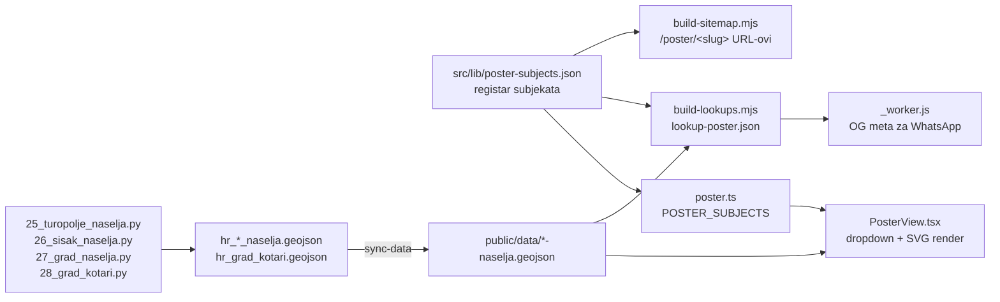

# Generator plakata — registar subjekata, fit imena, izvori

Stanje na 2026-08-30. Generator je narastao s 2 grada na **18 subjekata**, a s
njima su došla tri problema koja se ne vide iz koda: kako se subjekt definira,
kako ime naselja stane u svoj poligon, i po čemu je područje ovako omeđeno.

## Osamnaest plakata

| ruta | jedinice | km² | stanovnika | sloj |
|---|---|---|---|---|
| `/poster/zagreb` | 191 kvart | 641 | — | `kvartovi` |
| `/poster/velika-gorica` | 58 naselja | 327 | 61.075 | `turopolje` |
| `/poster/velika-gorica-cetvrti` | 8 gradskih četvrti | 37 | — | `kvartovi` |
| `/poster/kravarsko` | 10 naselja | 58 | 1.824 | `turopolje` |
| `/poster/pokupsko` | 14 naselja | 106 | 1.926 | `turopolje` |
| `/poster/orle` | 10 naselja | 59 | 1.765 | `turopolje` |
| `/poster/turopolje` | 115 naselja | 762 | 83.714 | `turopolje` |
| `/poster/plemenita-opcina` | 26 naselja | 194 | 45.005 | `turopolje` |
| `/poster/sisak` | 36 naselja | 424 | 40.245 | `sisak` |
| `/poster/sisak-okolica` | 92 naselja | 843 | 47.430 | `sisak` |
| `/poster/petrinja` | 56 naselja | 390 | 20.026 | `gradovi` |
| `/poster/split` | 8 naselja | 79 | 160.577 | `gradovi` |
| `/poster/split-kotari` | 27 gradskih kotara | 23 | — | `kotari` |
| `/poster/osijek` | 11 naselja | 175 | 96.313 | `gradovi` |
| `/poster/rijeka` | 34 mjesna odbora | 43 | — | `kotari` |
| `/poster/varazdin` | 10 naselja | 60 | 43.782 | `gradovi` |
| `/poster/dubrovnik` | 32 naselja | 143 | 41.562 | `gradovi` |
| `/poster/pula-okolica` | 84 naselja | 572 | 81.080 | `pula` |

Pravilo koje drži model dosljednim: **goli slug je uvijek cijela JLS u svojoj
prirodnoj jedinici** (Zagreb kvartovi, ostali naselja). Varijante dobivaju
eksplicitan sufiks (`-cetvrti`, `-kotari`, `-okolica`). Zato
`/poster/velika-gorica` znači cijelu JLS, a ne 8 gradskih četvrti kao u prvoj
verziji, a `/poster/sisak` Grad Sisak, ne njegovo urbano područje.

„Prirodna jedinica" nije uvijek naselje — v. poglavlje o Rijeci i Puli niže.

## Registar je jedan JSON, čitaju ga tri mjesta

`src/lib/poster-subjects.json` je jedini izvor istine. Novi plakat je jedan
unos u tom fileu — ništa drugo se ne dira (osim `POSTER_SOURCES` ako dolazi iz
novog geojsona).



Razlog za JSON umjesto TS konstante: build skripte su Node ESM i ne mogu
importati `.ts`. Prije toga je registar bio u `poster.ts`, pa bi OG kartica i
dropdown neizbježno otišli u različitim smjerovima.

### Polja koja nose logiku

| polje | čemu služi |
|---|---|
| `jlsMb` | lista JLS-ova; **više njih = objedinjeni plakat** |
| `unitFilter` | ime boolean propertyja koji jedinica mora imati — tako subjekt može biti podskup koji ne prati granice JLS-a (`plemenita_opcina`) |
| `outlines` | `["jls","regija"]` — koje obrise crtati preko ispuna |
| `unit` | sklonidba `[1, 2-4, 5+]`: „1 kvart, 2 kvarta, 5 kvartova" |
| `attribution` | izvor u footeru plakata; **razlikuje se po subjektu** |

### Zamka: filtar jedinica se zrcali na tri mjesta

`projectSubject()` (render), `stats` u `PosterView` (brojke u kontrolama) i
`countUnits()` u `build-lookups.mjs` (OG kartica) moraju filtrirati **isto**.
Kad je dodan `unitFilter`, lookup ga nije poštovao pa je OG kartica za
Plemenitu opčinu javljala *115 naselja* za plakat koji crta *26*. Ako mijenjaš
filtar, mijenjaj ga na sva tri mjesta.

## Imena se fitaju u oblik: upisani pravokutnik + rotacija

Prva verzija je birala font tako da natpis stane u **bbox** poligona, druga u
**vodoravni presjek na visini retka** (`spanAt()`). Oboje je bilo polovično:

- „Barbarići Kravarski" je ležao preko susjedne Podvornice — stao je u okvir
  svog poligona, ali ne i u sam poligon;
- Donja Lomnica (3,8 × 10,6 km, usko u sredini) i Podvornica **nisu dobile
  ime uopće** — sidro je bio centroid, a on kod takvih oblika pada u struk, pa
  je font pao ispod praga i natpis se tiho preskočio.

Od 2026-08-28 to radi `src/lib/label-fit.ts`, determinističkim postupkom bez
heuristike — naselje po naselje, neovisno o susjedima:

1. **Rasterizacija.** Poligon (vanjski prsten + rupe) u binarnu masku, ~128
   ćelija po duljoj stranici. Ćelija je „unutra" samo ako je *cijela* unutra:
   presjeci se računaju na **oba vodoravna ruba retka** i presijecaju, pa se
   maska još erodira za jednu ćeliju. Presjek samo na sredini retka propušta
   kosi rub koji zasiječe ćeliju — upravo su tako curila tanka dijagonalna
   naselja.
2. **Svi maksimalni upisani pravokutnici** maske, klasičnim „largest rectangle
   in histogram" postupkom sa stogom, O(redaka × stupaca).
3. **Kandidati loma imena** u 1–3 retka (sve particije po riječima); svaki lom
   daje svoj omjer stranica, pa i svoj najveći font u danom pravokutniku.
4. **Kutovi** 0°, ±15°, ±30°, ±45°: poligon se zarotira, pravokutnik ostaje
   osno poravnat, natpis se na kraju vrati u izvorni okvir.

Pobjeđuje najveći font, uz `tiltCost` (0.35) koji favorizira vodoravno i
blagu prednost pravokutniku bliže sredini oblika. Mjerenje na Turopolju (115
naselja): bez kazne za nagib 5 vodoravnih natpisa i prosjek 5,72 mm, s
kaznom ~90 vodoravnih i prosjek 5,6 mm — dakle mirniji plakat praktički
besplatno.

Rezultat: **2466 natpisa** (18 plakata × 3 formata), nijedan ne izlazi iz svog
poligona i nijedno naselje nije bez imena osim par najsitnijih zagrebačkih
mjesnih odbora s dugim imenima (`MIN_LABEL = 0.8` mm).

### Tri zamke oko mjerenja teksta, sve tri su rušile fit

Geometrija je bila lakši dio. Natpisi su i dalje izlazili iz poligona dok se
nisu riješile tri stvari koje nemaju veze s poligonima:

1. **`document.fonts.ready` ne čeka font koji nitko nije zatražio.** Natpisi
   su se mjerili prije nego što je Fraunces stigao, dakle zamjenskim serifom
   (~20 % uže), pa su ispali preveliki. Treba `document.fonts.load()`, a
   renderer javlja stanje kroz `data-labels="measured|pending"` — po tome e2e
   test zna kad je plakat gotov, umjesto da čeka tajmerom.
2. **Fraunces je varijabilni font s optičkom osi (`opsz`).** Glifovi na 4 px
   su osjetno širi nego na 40 px, pa mjera uzeta na jednoj veličini ne vrijedi
   za drugu. Zato `measure(line, size)` mjeri na veličini na kojoj se crta,
   fit se na kraju dotjeruje iteracijom, a klizač „Imena" ulazi **u sam fit**
   umjesto da naknadno skalira gotov natpis.
3. **`dominant-baseline="middle"` nije pouzdana referenca.** Browser taj pomak
   računa ovisno o kontekstu iscrtavanja — u CSS-skaliranom pregledu plakata
   ispao je drukčiji nego u pomoćnom elementu, pa je natpis sjedao ~0,2 em
   previsoko. Sada se atribut ne koristi: `y` svakog `tspan`-a **je** pismovna
   linija, a blok se centrira po izmjerenoj tinti (`dyEm`).

### Odbačeno i otvoreno

Za naselja u koja natpis ne stane razmatrane su tri izlazne strategije:
**leader line** u bjelinu izvan poligona, **broj u poligonu + numerirana
legenda**, i **niži prag čitljivosti**. Odabran je treći — plakat je vektor i
na 300 dpi printu je i milimetarski natpis čitljiv, a prve dvije unose
grafiku koja plakat čini nemirnijim nego što problem zaslužuje. Nakon
upisanog pravokutnika + rotacije ispada da je izbor jeftin: fallback treba
samo najsitnijim zagrebačkim mjesnim odborima.

Otvoreno: na zagrebačkom plakatu 3–6 mjesnih odbora s dugim imenima
(„Nadbiskup Antun Bauer", „Hrvatski narodni vladari") padne ispod
`MIN_LABEL = 0.8` mm i preskoči se. Odluka je uređivačka — spuštanje praga ih
sve vraća, ali kao vrlo sitan tekst.

### Provjera je automatska, ne na oko

`e2e/poster-labels.spec.ts` uzima ono što je stvarno nacrtano (`tspan` x/y,
font-size, rotacija), izmjeri otisak slova canvasom i svaki vrh te kutije
testira s `SVGGeometryElement.isPointInFill` nad poligonom istog naselja —
par se poznaje po `data-unit` atributu. Ide preko tri plakata × tri formata,
plus sva tri fonta i krajnji položaji klizača.

`node scripts/audit-poster-labels.mjs [--all] [slug]` vrti isti engine u
nodeu (bez preglednika — `label-fit.ts` i `poster-geom.ts` namjerno nemaju
runtime importe) i ispisuje kut, broj redaka i veličinu za svako naselje.
Širine su ondje procijenjene iz tablice, pa je to izvještaj o geometriji
(„koje je naselje tijesno"), a mjerodavan render je preglednik.

Naslov i podnaslov se od 2026-08-28 skaliraju **i po širini**:
„PLEMENITA OPČINA TUROPOLJSKA" je dvostruko duži od „ZAGREB" i prije bi
jednostavno prešao rub papira. Faktor `0.72` = širina znaka `0.6` +
letter-spacing `0.12`, oboje u jedinicama font-sizea.

## Turopolje: opseg je urednička odluka, ne geometrija

Geometrija je DGU RPJ, ali **koja naselja čine regiju nije podatak nego
odluka**. Uzet je izvor:

> Mladen Klemenčić, „Turopolje uzduž i poprijeko", *Studia lexicographica*
> 15(2021)29, 141–151. <https://doi.org/10.33604/sl.15.29.8>

Urednik *Turopoljskog leksikona* (LZMK, 2021) ondje objašnjava kako je
uredništvo omeđilo regiju: 4 JLS u cijelosti + **„15 naselja iz sastava Grada
Zagreba"** + **„sjeverni dio [općine Lekenik] s ukupno osam naselja"**. Naš
popis daje točno 15 + 8.

Zato footer tog plakata nosi dvije atribucije:
`podaci: DGU RPJ · opseg: Turopoljski leksikon (LZMK, 2021)`.

### Što je namjerno izostavljeno i zašto

| izostavljeno | razlog |
|---|---|
| **Brezovica** | Klemenčić je izrijekom isključuje uz Svetu Klaru i Jakuševec; iz općine Odra izdvojena 1913.; povijesno okićko, ne turopoljsko područje |
| **Vrh Letovanićki**, **Palanjek Pokupski** | nema izvora; u južnoj trećini Lekenika (45,51° N naspram 45,55–45,61 za sjevernih osam); nisu u župi Pešćenica |
| Lučko, Sveta Klara, Trnsko, Savski gaj, Jakuševec | sjeverno od zagrebačke obilaznice (1981.), koju Klemenčić uzima kao praktičnu sjevernu crtu; većina ionako nisu DGU naselja nego dijelovi naselja Zagreb |
| južni Lekenik (Letovanić, Žažina, Šišinec, Stari Brod, Stari Farkašić, Brkiševina, Pokupsko Vratečko, Petrovec) | Pokuplje / sisačka Posavina |
| Greda, Sela, Odra Sisačka | „jugoistočni dio Turopolja" po Proleksisu, ali izvan definicije leksikona — kandidati za prijelazni pojas |

### Dvije zamke u imenima

- DGU piše **Pešćenica**, ne „Peščenica".
- **Cerovski Vrh** je naselje Grada Velike Gorice, ne Lekenika — popisi ga
  znaju krivo svrstati.

### Neriješena brojka

Klemenčić piše da njegov obuhvat daje „nešto manje od 1000 km²", a zbroj DGU
poligona za tih 115 naselja je **762 km²**. Hrvatska enciklopedija za
Turopolje kaže „oko 600 km²" (≈ naša jezgra od 550). Naš broj sjeda između, i
svaki je član popisa zasebno potkrijepljen, ali razlika se ne može razriješiti
bez samog leksikona — nije digitaliziran.

## Plemenita opčina je zaseban sloj, ne granica

22 sučije po M. Šenoi (1910: 8), preslikane na današnji DGU registar:
Polje 10, Vrhovlje 9, pridružena naselja 7 = **26 naselja**.

Ide kao zaseban plakat, a ne kao granica Turopolja, jer Klemenčić (2021: 144)
izrijekom kaže da se označavanjem samo „plemenitaških" naselja *„ne dobije
prostorno homogeno i posve zaokruženo područje"*. Plakat to i pokazuje:
26 ispuna preko tankog obrisa cijele regije, s vidljivim rupama.

Preslikavanje nije 1:1:

- „Gornji i Donji Lukavec" → danas jedno naselje **Lukavec**
- „Dragonožec" → **Donji** i **Gornji Dragonožec**
- Lazi → **Lazi Turopoljski**, Markuševec → **Markuševec Turopoljski**,
  Petravci → **Petravec**, Jarebić → **Jerebić**
- **Mala Gorica, Kurilovec, Pleso, Rakarje, Kušanec** nemaju današnjeg
  parnjaka — danas su gradske četvrti *unutar* naselja Velika Gorica. Grad ih
  je apsorbirao, pa ih pokriva to naselje, koje je ionako bilo sučija.

Skripta puca ako se ijedan unos popisa ne nađe — tiho preskakanje bi dalo
nepotpun sloj koji nitko ne bi primijetio.

## Pipeline korak 25: dvije provjere koje se isplate

`apps/data-pipeline/scripts/25_turopolje_naselja.py`:

- **Svako ime s popisa mora se naći** u DGU naseljima, inače `sys.exit(1)`.
  Uhvatilo „Peščenicu".
- **Dissolve svih naselja mora biti jedan poligon bez rupa**, inače upozorenje.
  Uhvatilo da Vrh Letovanićki i Palanjek Pokupski vise kao otok — što se i
  vidjelo na plakatu kao odvojena mrlja.

### `simplify()` je izbačen, i to dvaput na štetu

Prva verzija je pojednostavljivala geometriju na 5 m u EPSG:3765. Dvije
posljedice:

1. **20 sliver-rupa** u uniji — `simplify()` reže vrhove neovisno na svakoj
   strani zajedničkog ruba, pa se susjedna naselja razmaknu.
2. Bio je **veći**: 0,37 MB naspram 0,23 MB sirovog. DGU naselja su već
   pojednostavljena u koraku 18, pa se nema što dobiti.

Ostalo je samo rezanje koordinata na 6 decimala (~10 cm), što je topološki
sigurno jer isti ulazni vrh daje isti izlazni.

## Sisak: obuhvat je akt, ne procjena

Dva plakata iz jednog sloja (`26_sisak_naselja.py` → `sisak-naselja.geojson`),
istim obrascem kao Turopolje, ali bez uredničkog popisa naselja — jer za
"Sisak i okolicu" postoji službena definicija:

| | JLS | naselja | km² | stanovnika |
|---|---|---|---|---|
| `/poster/sisak` | Sisak (03913) | 36 | 424 | 40.245 |
| `/poster/sisak-okolica` | + Sunja (04260), Martinska Ves (02593) | 92 | 843 | 47.430 |

**Sisak i okolica = Urbano područje Sisak.** Grad Sisak je središte, Sunja i
Martinska Ves članice. Ministarstvo regionalnoga razvoja i fondova EU
očitovalo se na konačni prijedlog obuhvata 28. 10. 2020., članice su
11. 8. 2021. sklopile Sporazum o suradnji na izradi i provedbi Strategije
razvoja Urbanog područja Sisak 2021.–2027., a Gradsko vijeće Grada Siska
donijelo je **Odluku o sastavu Urbanog područja Sisak 19. 10. 2022.**
<https://sisak.hr/itu-mehanizam/uspostava-urbanog-podrucja-sisak/>

Zašto ne „Sisak + sve susjedne JLS": Sisak graniči s **devet** JLS-ova, jer se
njegovo područje proteže na istok kroz Lonjsko polje (do 16,78° E). Među
susjedima su tako i Kutina, Popovača, Lipovljani i Velika Ludina — Moslavina,
koja nije sisačka okolica. Svaki bi rez tu bio naša procjena; ovaj ima potpis,
pa footer nosi `obuhvat: Urbano područje Sisak (2022)`.

Razlika prema Turopolju je poučna: ondje je obuhvat morao biti izveden iz
literature naselje po naselje (`TUROPOLJE_NASELJA`), jer povijesna regija nema
službenu granicu. Ovdje su granice JLS-a **jesu** definicija, pa skripta nema
popis imena — ali zato ima provjeru broja naselja po JLS-u
(`EXPECT_NASELJA` 36/40/16): ako se DGU registar promijeni, korak padne
umjesto da tiho izbaci drukčiji plakat.

### Što je bilo neizvjesno u smještaju natpisa

Posavska naselja uz Savu su uske trake okomite na rijeku (Lijevo/Desno
Trebarjevo, Lijevo/Desno Željezno) — točno onaj oblik na kojem je centroidni
smještaj padao. Upisani pravokutnik + rotacija to rješava bez iznimke: svih
92 naselja dobije ime u sva tri formata, najsitnije je „Lijevo Željezno" na
1,42 mm (pejzaž), dakle iznad `MIN_LABEL`. Zato je `sisak-okolica` dodan u
`e2e/poster-labels.spec.ts` uz Turopolje.

## Kad grad nema naselja: Rijeka, Pula, Split

Model „goli slug = cijela JLS u svojoj prirodnoj jedinici" pretpostavlja da JLS
ima više od jedne jedinice. Za tri grada ne vrijedi, i to na tri različita
načina — provjereno protiv DGU registra i OSM-a 2026-08-30:

| grad | DGU naselja | OSM admin_level=9 | ishod |
|---|---|---|---|
| **Rijeka** | **1** (43,4 km², 107.964 st.) | **34/34** mjesna odbora | `/poster/rijeka` po mjesnim odborima |
| **Split** | 8, ali je Split 160k od 161k st. | **27/27** gradskih kotara | `/poster/split` (naselja) + `/poster/split-kotari` |
| **Pula** | **1** (53,8 km², 52.220 st.) | **4** od ~15 MO | Pula sama je neizvediva → `/poster/pula-okolica` |
| Osijek | 11 | 10 od 13 GČ | naselja (OSM nepotpun) |
| Varaždin | 10 | 0 | naselja |

Rijeka je zato prvi subjekt kojemu je **prirodna jedinica mjesni odbor**, kao
što je Zagrebu kvart — goli slug i dalje znači cijelu JLS, samo u jedinici koja
za taj grad postoji. Provjera je mjerenje, ne dojam: unija 34 riječka MO daje
**43,1 km²** naspram 43,1 km² DGU granice grada, dakle potpuno pokrivanje.
Splitskih 27 kotara pokriva 23,1 km² od 78,9 km² JLS-a — urbani dio; ostatak su
prigradska naselja, koja i dalje stoje na `/poster/split`.

### Pula: što se NIJE napravilo

Pula ima ~15 mjesnih odbora, ali OSM ih ima 4 (Arena, Busoler, Gregovica,
Kaštanjer), a poligoni nisu objavljeni ni na jednom otvorenom izvoru. Plakat
od 4 od 15 jedinica izgledao bi ispravno i **bio bi netočan** — točno onaj tihi
kvar zbog kojeg korak 28 puca kad broj jedinica ne odgovara očekivanom
(`expect`), umjesto da izbaci nepotpun sloj.

Umjesto izmišljanja granica ide **Urbano područje Pula** — 8 JLS-ova sa
službenim obuhvatom:

> Grad Pula-Pola (središte), Grad Vodnjan-Dignano, općine Barban,
> Fažana-Fasana, Ližnjan-Lisignano, Marčana, Medulin, Svetvinčenat.
>
> — Strategija razvoja Urbanog područja Pula, Grad Pula-Pola

Isti postupak kao za `sisak-okolica`: obuhvat objedinjenog plakata mora imati
potpis, ne našu procjenu. **Otvoreno:** čim se pojavi poligonski izvor za
pulske mjesne odbore (grad ih objavi ili se OSM dopuni), `/poster/pula` se
dodaje kao jedan unos u registar i jedan grad u `CITIES` koraka 28.

### Priobalje mijenja dvije pretpostavke

1. **Obuhvat nije jedan poligon.** Turopoljska provjera „dissolve mora biti
   jedan povezan poligon bez rupa" je za Pulu besmislena — Brijuni i ostali
   otoci daju 37 dijelova, što je točno, ne kvar. Zato grupa ima zastavicu
   `coastal` koja tu provjeru pretvara u ispis.
2. **Slivere treba mjeriti, ne brojati.** Unija OSM kotara ispada u 14 dijelova
   za Split i 2 za Rijeku, ali je najveći 23,086 od 23,1 km² odnosno 43,141 od
   43,2 — ostalo su komadi ispod 1000 m², artefakti nedijeljenih OSM rubova.
   Nijedna jedinica nije izvan glavnog dijela. Broj dijelova sam po sebi ne
   znači ništa; njihove površine znače.

### Dva sloja iz jedne skripte

`27_grad_naselja.py` je table-driven: `GROUPS` mapira grupu na output file, pa
Petrinja/Split/Osijek/Varaždin/Dubrovnik idu u `hr_gradovi_naselja.geojson`, a
Pula u svoj. Razlog za razdvajanje nije veličina nego `razina="regija"`:
`projectSubject()` uzima obuhvat **bez obzira na `jlsMb`** (nosi
`jls_maticni_broj` `"*"`), pa dva različita obuhvata u istom fileu ne mogu
supostojati. Skup nepovezanih gradova zato namjerno **nema** regija feature —
dissolve pet gradova raštrkanih po Hrvatskoj postao bi okvir plakata i Varaždin
bi ispao veličine poštanske marke.

Korak 28 je zaseban file, a **ne** proširenje koraka 23/24, iako su i tamo OSM
gradske četvrti (Velika Gorica). Zagrebački sloj je izveden iz kuriranog
mappinga i ponovno vrtjeti 23/24 značilo bi riskirati tihu promjenu već
objavljenog zagrebačkog plakata radi Rijeke.

## Zamka u alatu: `tsc -p tsconfig.json` ne provjerava ništa

Root `tsconfig.json` ima `"files": []` i samo `references`. `npx tsc --noEmit
-p tsconfig.json` zato **prolazi i kad kod ne kompajlira**. Koristi:

```bash
npx tsc -b --force        # ili npm run build, koji ionako vrti tsc -b
```

`npm run lint` u ovom checkoutu ne radi — `eslint` nije instaliran u
`node_modules/.bin`. Nije blokirajuće jer build vrti `tsc -b`, ali lint
zapravo nikad ne prolazi.

## Deploy

Engine je na produkciji (`gis.domovina.ai`, CF Pages projekt `gis-domovina`)
od 2026-08-29, sisački plakati od 2026-08-30. Verificirano mjerenjem na živoj
domeni, ne screenshotom — postupak i brojke u
`2026-08-17-deploy-verifikacija.md`, poglavlje „Grafika koja se računa".

Produkcijski prolaz za Sisak (bundle `index-D3p89x4s.js`, isti hash kao lokalni
`dist/`): `sisak` 36 natpisa i `sisak-okolica` 92 natpisa u sva tri formata —
**0 izvan poligona**, najmanji font 1,2 px SVG-a na pejzažu.

## Vezani dokumenti

- [`2026-08-17-deploy-verifikacija.md`](./2026-08-17-deploy-verifikacija.md) —
  tihi kvarovi u deploy lancu; poglavlje 4 opisuje SW koji se nije instalirao
- [`ui-refactor-plan.md`](./ui-refactor-plan.md) — plan UI refactora
