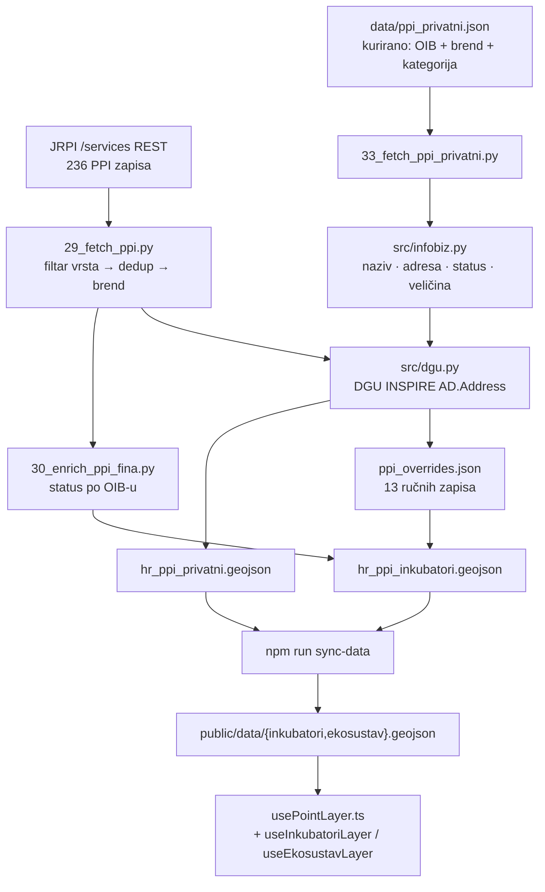

# Inkubatori i privatni ekosustav — izvori, geokodiranje, zamke

Stanje na 2026-09-06. Grupa slojeva **„Gospodarstvo i poduzetništvo"** dobila je
dva sloja: **Inkubatori** (82 subjekta, državni registar) i **Privatni
ekosustav** (11 subjekata, kurirano). Ovaj dokument drži ono što se ne vidi iz
koda: odakle podaci, zašto su dva sloja a ne jedan, i pet zamki koje su koštale
vremena.

## Sažetak

| | Inkubatori | Privatni ekosustav |
|---|---|---|
| izvor | JRPI (MINGO), javni REST | kurirani popis + FINA info.BIZ |
| autoritet | državni upis | ljudska prosudba |
| subjekata | 82 (od 89 zapisa, 236 u registru) | 11 |
| skripta | `29_fetch_ppi.py` → `30_enrich_ppi_fina.py` | `33_fetch_ppi_privatni.py` |
| kratica / ikona | `I` / `Rocket` | `E` / `Network` |
| paleta | hladna | topla |
| adresna preciznost | 82/82 | 11/11 |
| ne posluje (FINA) | 5 | 0 |

## Tok podataka



Brojevi skripti idu **29 → 30 → 33**. Nije rupa: 31 i 32 zauzele su zagrebačke
open-data skripte iz paralelne sesije.

## Izvor 1 — JRPI

`https://jrpi.mingo.gov.hr/` je Angular SPA, ali pod njom stoji **javni REST bez
ikakve autentikacije**, base `/services`:

```
GET  /services/kategorije/PPI_VRSTA/getAll
POST /services/ppi/search              {"page":{"pageNum":0,"pageSize":2000}}  → 236
POST /services/ppi/kontaktOsobe/search                                          → 769
```

Odgovor je `{data, totalCount, isFaulted, faultCode, faultMessage}` — **greška
dolazi s HTTP 200**, pa se mora čitati `isFaulted`.

### Registar ima GeoServer, ali on ne pomaže

Ovo je nalaz koji je odredio cijeli pristup. Postoji `/services/wfs` sa slojem
`jrpi:jrpi_poduzetnicke_potporne_institucije`, uredno vraća GeoJSON, i:

```
236 značajki — 5 s geometrijom, 231 `geometry: null`
```

Poslovne zone su jednake: 37 od 354. **Registar je autoritativan za atribute i
beskoristan za položaj.** Adresa je jedini put do točke, i srećom je čista:
uzorak `ulica broj, mjesto pbr` pogađa 234 od 236.

Ako se ikad vraćaš na poslovne/slobodne zone: imaju isti problem, ali **bez
adrese kao izlaza**. To je razlog zašto nisu u ovoj rundi.

### Opseg i dedup

Uži izbor je `vrsta_ppi_id ∈ {5, 7, 8, 9, 11, 12}` (konstanta `STARTUP_VRSTE`;
proširenje na svih 236 je izmjena tog jednog retka). Izvan njega ostaju
poduzetnički centri (64) i razvojne agencije (80) — potporna infrastruktura, ali
ih nitko ne zove inkubatorom.

**Ista pravna osoba upisana je jednom po vrsti.** ZICER je u registru tri puta,
TICM tri puta, PC Krapinsko-zagorske tri puta. Bez spajanja to su tri točke jedna
preko druge. Dedup ide po `(OIB, adresa)`, **ne po samom OIB-u**: Istarska
razvojna agencija vodi PI „Izazov" i TI Pula na dvije stvarne lokacije.

89 zapisa → 82 subjekta.

## Izvor 2 — FINA info.BIZ

JRPI je registar **upisa**, ne stanja. Brisani subjekti ostaju u njemu, i karta
koja to prešuti tvrdi da inkubator radi. `infobiz.fina.hr` daje po OIB-u službenu
veličinu i pravni status, besplatno i bez Firecrawla.

**Profil se ne može složiti iz OIB-a** — URL nosi i slug imena
(`/tvrtka/zagrebacki-inovacijski-centar-d-o-o/OIB-53921712112`,
`/neprofitni/osc/OIB-06519815245`), a pretraga je iza reCAPTCHA-e. Kartu OIB→URL
gradi sestrinski `company-details-api` iz osam sitemapova (~56 MB, 318 899
subjekata) i drži je u svom kešu; ovdje se taj keš **samo čita**.

Ako indeksa nema, `30_enrich_ppi_fina.py` izađe s **0** i ne dira GeoJSON — sloj
mora raditi i bez obogaćivanja. Provjereno testom koji privremeno preusmjeri
`infobiz.INDEX` na nepostojeću putanju i tvrdi da su bajtovi izlaza identični.

Rezultat: **5 od 82 subjekta u službenom registru zapravo ne posluje** —
Poduzetnički potporni centar i Core Inkubator (likvidacija), INTEGRAL STRUCTURES
i Tehnološki centar Split (brisani), VRH (stečaj).

## Zašto dva sloja, a ne jedan

Kurirani popis je razmatran kao dodatne točke u sloju Inkubatori. Odbačeno:
JRPI je državni upis, kurirani popis je naša prosudba. Spojiti ih značilo bi
tvrditi jednaku pouzdanost za oboje, a korisnik ne bi imao načina razlikovati.

Umjesto toga: odvojen toggle, **topla paleta nasuprot hladnoj**, oznaka
„kurirano" u podnaslovu popupa, i polje `napomena` koje kaže **zašto je subjekt
na popisu** — kod kuriranog skupa to je jedino što stoji umjesto registarskog
autoriteta.

Preklapanje po OIB-u **ruši pipeline** (`33_…` izlazi s 1), plus zaseban e2e
test. Isti subjekt na obje karte je dvostruko brojanje.

### Kurirani popis: identitet je OIB, ne ime

U `data/ppi_privatni.json` stoji samo ono što registar ne zna — brend,
kategorija, web, obrazloženje. Naziv, adresa, pravni oblik, NKD, veličina i
status **dohvaćaju se iz FINA-e**, pa popis preživi preseljenje i preimenovanje.

Dodavanje subjekta = jedan zapis s OIB-om, brendom i kategorijom, pa pokretanje
skripte. Ostalo se povuče samo.

## Pet zamki

### 1. Dva naselja se zovu „Poreč"

Istarski grad je u DGU RPJ-u upisan kao **„Poreč - Parenzo"**. Postoji i selo kraj
Nove Gradiške koje se zove doslovno **„Poreč"**. Upit `naselje='Poreč'` nad
adresnim slojem uredno vrati selo i javi uspješan pogodak — Poduzetnički
inkubator Poreč je tako sjeo na 17,92 E, **250 km od mora**.

```
naselje='Poreč'             → 1 pogodak  (slavonsko selo)
naselje='Poreč - Parenzo'   → 5 pogodaka (pravi grad)
naselje='Rovinj'            → 0 pogodaka
naselje='Rovinj - Rovigno'  → 5 pogodaka
```

U RPJ-u je **114 dvojezičnih naselja**. Indeks se zato gradi pod dva ključa —
puni naziv i dio prije `" - "` — a kandidati se rangiraju po podudaranju JLS-a.
Vrijedi za svaki budući geokodirani sloj.

Oprez pri splitanju: nije svaki `" - "` prijevod. „Podstrana - Sv. Martin" je
složeni naziv.

### 2. Petlja koja odustaje nakon prvog kandidata

Grana za seoske adrese izgledala je kao da prolazi sve kandidate:

```python
for n in settlement_candidates(idx, adr["ulica"], jls):
    hit = dgu.geocode(n.rpj_naziv, None, adr["broj"])
    if hit:
        return hit.lat, hit.lng, "dgu-adresa"
    return n.lat, n.lng, "naselje"     # ← izlazi u PRVOJ iteraciji
```

Efektivno `if kandidati: uzmi prvog`. Time se poništava upravo ono rangiranje
koje razrješava dvojezična naselja. Na današnjim podacima izlaz je isti (nijedan
subjekt ne pada u tu granu), pa se ne bi primijetilo dok podatak ne stigne.

### 3. JRPI-ju otpada vodeća nula u OIB-u

Tri od 236 zapisa imaju 10 znamenki — negdje se OIB drži kao broj.
„9496667599" je zapravo `09496667599` (Evolve Uni Tech, potvrđeno u info.BIZ-u).
Posljedica: sudreg poveznica u popupu vodi u prazno, spajanje na FINA-u tiho
promaši.

Nadopuna ide **samo uz provjeru kontrolne znamenke** (ISO 7064 MOD 11,10). Ako
broj nakon nadopune ne prolazi, posrijedi je nešto drugo i ostaje kakav jest —
greška se treba vidjeti, ne zakrpati.

### 4. FINA statusi ne glase kako FINA dokumentira

Izmjereno na stvarnim profilima: `Aktivan`, `Likvidacija`, `Neaktivan/izbrisan`,
`otvoren stečajni postupak`. Podudaranje po punom nizu („u likvidaciji",
„brisan", „u stečaju") **ne pogodi ništa** i sve proglasi aktivnim. Traži po
korijenu.

Usput: info.BIZ piše adresu kao `Radnička cesta 50, 10000 Zagreb` — poštanski
broj **ispred** mjesta, obrnuto od JRPI-ja (`Rakovac 6, Karlovac 47000`).
Zajednički parser bi tiho pukao.

### 5. `minzoom: 6`, a zadani pogled je zoom 5,93

Sloj se palio i **nije se vidjelo ništa**, bez ijedne greške u konzoli. Korisnik
bi to doživio kao pokvaren sloj. Uhvatio e2e test koji traži da renderiranih
značajki bude više od nule na zadanom pogledu.

## Ostalo iz podataka

**Registar vodi pravni naziv, koji brend zna sakriti do neprepoznatljivosti.**
Impact Hub Zagreb = „Pokreni ideju j.d.o.o.", HUB385 = „NEST 01 d.o.o.",
Algebra LAB = „DigiBoost d.o.o.", Invento Capital = „Optimizacija d.o.o.".
`kratki_naziv` je iznenađujuće dobar i uz skidanje pravnog oblika pokriva
većinu; ostatak je u `ppi_overrides.json`.

Regex za pravni oblik je namjerno **uzak**. Prva verzija je hvatala i goli
„za …" pa je „CENTAR ZA RAZVOJ I EDUKACIJU POLIČNIK" skratila na „CENTAR", i
„zadruga" bilo gdje u nizu pa je od „Poduzetnička zadruga Osvit — …" ostalo
„Poduzetnička". Prekomjerno rezanje je gore od nerezanja.

**Fil Rouge Capital nema hrvatsko sjedište.** OIB 91054466414 je podružnica
ciparskog subjekta i u info.BIZ-u nosi adresu u Strovolosu; upravljanje fondom je
luksemburško (FRC Fund Management S.à r.l.). Na kartu ide zagrebački ured s
njihove vlastite kontakt stranice (Trg Kralja Tomislava 15). Crunchbase i
ZoomInfo navode Jurišićevu 24 — zastarjelo.

**Odbijanje geokodera je značajka.** Pravilo razlikovnosti odbilo je „Bukovačka
42, Zagreb" jer `ILIKE '%Bukov%'` vraća i „Bukovac 42" i „Gornji Bukovac 42".
Prag se **ne spušta** — koordinata ide u override s obrazloženjem.

**`povrsina_m2 = 0`** u registru znači „nije prijavljeno", ne nula kvadrata. Ne
prosljeđuje se, da popup ne tvrdi neistinu.

## Održavanje

```bash
cd apps/data-pipeline
.venv/bin/python scripts/29_fetch_ppi.py          # JRPI + geokodiranje
.venv/bin/python scripts/30_enrich_ppi_fina.py    # status po OIB-u
.venv/bin/python scripts/33_fetch_ppi_privatni.py # kurirani popis
cd ../karta-web && npm run deploy
```

Keširano je u `data/raw/{jrpi,fina,dgu}/` (gitignorirano). Za svjež dohvat obriši
odgovarajući poddirektorij.

Nakon svakog osvježenja provjeri: **broj subjekata**, `geo_source` raspodjelu
(nijedan ne bi smio biti `naselje`), i **siročad u overrideima** — ključ koji ne
pogađa nijedan subjekt skripta ispisuje kao upozorenje, jer je to tiha greška
istog roda kao `skip` u `sync-data.mjs`.

## Što je namjerno izostavljeno

- **Poslovne i slobodne zone** iz JRPI-ja — grupa `gospodarstvo` je otvorena zbog
  njih, ali imaju isti geokodirajući problem bez adrese kao izlaza.
- **South Central Ventures** — nema hrvatski registriran subjekt u info.BIZ
  indeksu, pa nije bilo čime potvrditi lokaciju.
- **Startup Croatia** — raspuštena udruga (`Neaktivan/izbrisan`). Sloj Inkubatori
  zadržava mrtve subjekte jer vjerno prikazuje registar; kurirani popis nema tu
  obvezu. Razlog stoji u `_izostavljeni` da se ne vrati bez razmišljanja.

## Vezani dokumenti

- [`2026-08-17-deploy-verifikacija.md`](2026-08-17-deploy-verifikacija.md) —
  zašto se deploy provjerava na produkciji, a ne lokalno
- [`2026-08-28-poster-generator.md`](2026-08-28-poster-generator.md) — registar
  subjekata i fit imena u poligon
