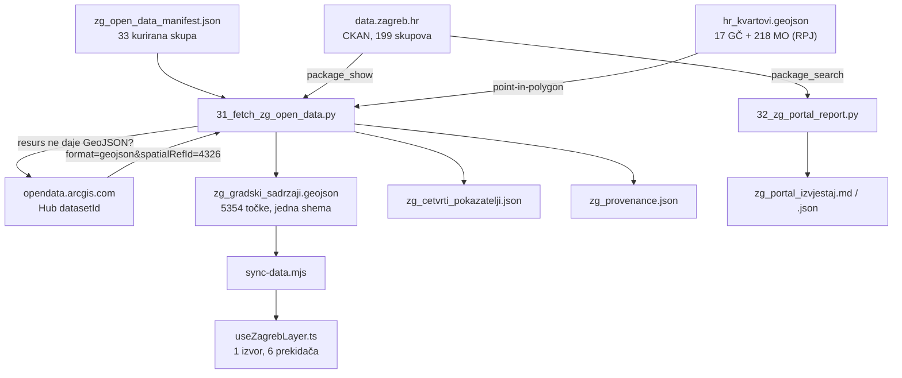

# Zagrebački otvoreni podaci — mehanika, odbačene alternative, zamke

6.9.2026. Nastalo uz [dosje natječaja Grada Zagreba](./natjecaj-otvoreni-podaci-zg-2026/README.md).
Ovdje je ono što se ne vidi iz diffa: zašto je pipeline složen ovako, što je
probano pa odbačeno, i koje zamke portala će sljedeći prolaz inače ponovno
otkriti.

Kod: `apps/data-pipeline/scripts/31_fetch_zg_open_data.py`,
`32_zg_portal_report.py`, `apps/karta-web/src/hooks/useZagrebLayer.ts`.

---

## Tok podataka

---

## Odluke i odbačene alternative

### Manifest umjesto prepisanih URL-ova resursa

Korak 23 (`23_fetch_kvartovi.py`) hardkodira dva URL-a shapefileova s CKAN-a i
to radi već godinu dana. Za 33 skupa isti pristup ne preživi: ArcGIS Hub ispod
portala mijenja potpise datoteka (`PO_-70661234….geojson`), pa URL prepisan iz
kataloga zastari bez ikakve poruke.

Zato manifest vodi **CKAN `name`**, a URL se razrješava kroz `package_show` u
vrijeme dohvata. Cijena je jedan dodatni HTTP zahtjev po skupu; dobitak je da
skripta preživi promjene na portalu.

### Ne vjerovati polju `format`

Prvo je isprobano jednostavno: uzmi prvi resurs kojem je `format == "GEOJSON"`.
Palo je odmah — `geoportal-djecji-vrtici` ima resurs deklariran kao GEOJSON čiji
URL glasi `…&format=fgdb`. To je File Geodatabase u ZIP-u i `json.loads` puca na
prvom bajtu.

Rješenje koje je prošlo: iz URL-a bilo kojeg resursa izvuci ArcGIS Hub
`datasetId` (`/api/v3/datasets/<id>/downloads/data`) i **sam sastavi** zahtjev s
`format=geojson&spatialRefId=4326`. Isti postupak usput spašava i skupove koji
vrate HTTP 500.

### Prostorni spoj umjesto atributa iz izvora

Gradska četvrt postoji u izvorima pod šest različitih imena polja
(`GRAD_CETVRT`, `Gradska_cetvrt`, `grad_cetvr`, `grad_cetv`, `naziv_gc`,
`IME_GC`), a u polovici skupova ne postoji uopće.

Razmotreno i odbačeno: uzeti vrijednost iz izvora gdje postoji, ostaviti prazno
gdje ne postoji. To bi dalo sloj u kojem polovica točaka nema četvrt, a druga
polovica ima četvrt čiju točnost nitko nije provjerio.

Umjesto toga četvrt se **uvijek** računa point-in-polygon iz `hr_kvartovi.geojson`,
a vrijednost iz izvora zadržava zasebno kao `gc_izvor`. Time neslaganje postaje
mjerljivo. Prvi prolaz je prijavio 205 neslaganja — od čega je **200 bilo krivo
mapiranje u manifestu, ne greška u podacima**. Ostalo ih je pet stvarnih.

To je ujedno i pouka: nalaz o tuđim podacima ne prijavljuje se prije nego je
isključeno da je greška vlastita.

### Šest prekidača, jedan izvor

`usePointLayer` (uveden uz sloj Inkubatori) radi jedan MapLibre izvor po
datoteci. Za šest skupina to bi značilo šest `fetch`-eva **iste** 3,3 MB datoteke
i šest kopija GeoJSON-a u memoriji preglednika.

`useZagrebLayer` zato drži jedan izvor i jedan `circle` sloj, a prekidači
mijenjaju `filter` po polju `skupina`. E2e test to i mjeri: brojač zahtjeva mora
ostati na 1 nakon uključivanja druge skupine.

---

## Zamke portala

| Zamka | Posljedica ako se previdi |
|---|---|
| `format` u katalogu ne odgovara posluženom | parser puca na ZIP-u umjesto JSON-a |
| `opendata.arcgis.com` vraća HTTP 500 na **nasumičan** skup | nadzor prijavi kvar na skupu koji radi |
| Shema atributa različita po skupu | naziv objekta ispadne prazan ili se uzme adresa |
| `JMS_IME` / `JMS_IME_1` zamijenjeni između dva sestrinska skupa | 184 spremnika u krivoj četvrti |
| Ime četvrti pisano na tri načina | 16 lažnih neslaganja iz čistog stila pisanja |
| Skupovi Grada nisu ograničeni na Grad | 24 točke „izvan granica" izgledaju kao greška, a nisu |

### HTTP 500 koji šeta

Najskuplja zamka jer se ne vidi. Dva uzastopna pokretanja `32_zg_portal_report.py`
prijavila su 500 na **dva različita skupa** — prvi put `geoportal-vatrogasci`,
drugi put `geoportal-sjedista-gradskih-cetvrti`. Bez ponavljanja pokušaja
izvještaj svaki dan optuži nasumičan skup, a Grad dobije prijavu kvara koji ne
postoji.

Sada se svaki resurs probava tri puta s rastućim odmakom; prijavljuje se samo
ono što padne u sva tri. Nakon toga ostaju tri stvarna kvara, stabilna kroz
pokretanja.

### Ime četvrti u tri oblika

`Maksimir`, `Gradska četvrt Maksimir`, `GRADSKA ČETVRT MAKSIMIR` — sve tri se
pojavljuju u različitim skupovima. Usporedba bez skidanja prefiksa i dijakritike
mjeri stil pisanja, ne neslaganje.

---

## Stvarni nalazi o portalu (6.9.2026.)

Reproducira `32_zg_portal_report.py`; puni nalaz u
`apps/data-pipeline/outputs/zg_portal_izvjestaj.md`.

- **99 od 199 skupova (50 %) nije dirano preko dvije godine**; 14 u zadnja tri
  mjeseca. Većina `geoportal-*` stoji na veljači 2024.
- `geoportal-vjerske-zajednice` — URL resursa počinje s **`hhttps://`**
- `geoportal-djecji-vrtici` — GEOJSON resurs pokazuje na `format=fgdb`
- `proracun-grada-zagreba-2026` — CSV deklariran, XLSX posluženo
- `geoportal-kulturne-ustanove` = `geoportal-kultura` (isti ArcGIS `datasetId`)
- ZET, HŽ i područni odsjeci postoje dvaput pod gotovo istim naslovom: stara
  kopija s Huba (2024-02) i novi resurs na CKAN-u (2026-08), bez naznake koji je
  koji
- 1 skup bez licence (katastarske prostorne jedinice)
- **Nema nijednog skupa sa stanovništvom po gradskoj četvrti** — nijedan
  pokazatelj se ne može izraziti *per capita* iz gradskih otvorenih podataka

Pet zapisa gdje se atribut i položaj stvarno ne slažu: OŠ Ružičnjak, OGŠ Ivana
Zajca – područni odjel Susedgrad, privatna umjetnička gimnazija u Gundulićevoj,
dom za starije na Mlinovima 159, parkiralište za bicikle MUP Heinzelova. Izvor
ne kaže je li kriva koordinata ili atribut.

---

## Otvorene stavke

- **Poligonski skupovi nisu obuhvaćeni.** Manifest pokriva samo točkaste; ostaje
  ~75 geoprostornih skupova s poligonima (planirana namjena, pješačka zona,
  evakuacijske površine, topografska osnova, ZG3D po četvrtima).
- **Nema automatskog osvježavanja.** Harvester se pokreće ručno; nightly na
  GitHub Actions je dio prijedloga za natječaj, ne postojećeg stanja.
- **Pokazatelji su apsolutni, ne per capita** — dok Grad ne objavi stanovništvo
  po četvrti (v. gore).
- **Nalazi nisu poslani Gradu.** Kvarovi su nađeni i zapisani, ali
  `otvoreni.podaci@zagreb.hr` još nije obaviješten. Tri su trivijalna za popraviti
  (`hhttps://`, krivi `format`, dvostruka objava).
- **Sloj nije na produkciji.** Radi lokalno i prolazi 24/24 e2e, ali
  `npm run deploy` nije pokrenut — gis.domovina.ai ga još nema.
- **Nositelj autorskog prava u `LICENSE`** je fizička osoba; ako na natječaj
  prijavljuje pravni subjekt, treba uskladiti.

---

## Vezani dokumenti

- [Dosje natječaja](./natjecaj-otvoreni-podaci-zg-2026/README.md) — uvjeti, bodovna lista, prilozi
- [Prijedlog projekata](./natjecaj-otvoreni-podaci-zg-2026/prijedlog-projekta.md) — dva projekta za prijavu
- [TODO za prijavu](./natjecaj-otvoreni-podaci-zg-2026/TODO-prijava.md) — radna lista do 16.9.2026.
- [`LICENSE-PODACI.md`](../LICENSE-PODACI.md) — CC BY 4.0 / ODbL po izvoru
